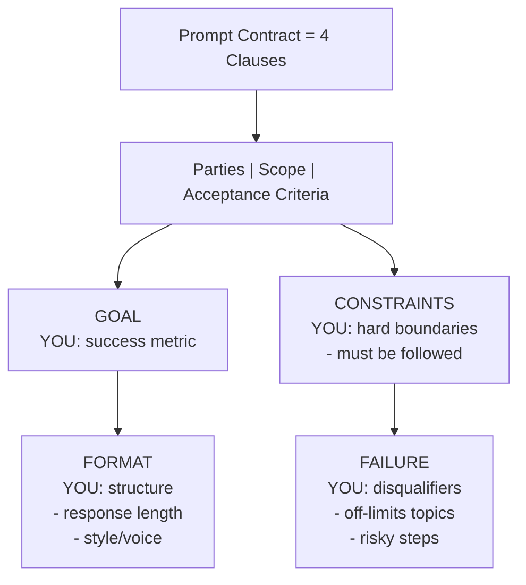

# 🚀 AI Prompt Library & Prompt Generator for Product Managers

A library of **160 prompts** and a built-in **Prompt Generator** for AI Product Managers and Product Leads. Built with prompt contracts. Works on all LLM assistants (ChatGPT, Claude, Gemini, HuggingChat, etc).

## Prompt Contract Standard Used In This Library

All prompts in this repository are written with a 4-clause **Prompt Contract**.
This is the operating standard for both `Prompts/` and `Workflows/`.

Generic prompt example:
`Write an email about our product launch. Make it engaging.`

Prompt Contract replaces vague instructions with explicit control:
1. `GOAL` -> exact success metric
2. `CONSTRAINTS` -> hard boundaries that must be followed
3. `FORMAT` -> required output schema/structure
4. `FAILURE` -> measurable disqualifiers

Why this matters:
- Prompt quality can be reviewed before running the model.
- Output compliance can be checked objectively.
- Fewer rewrite loops because requirements are explicit.
- The model optimizes against concrete failure modes.

Weak instruction:
`Don't sound marketing-y`

Measurable failure condition:
`FAILURE if contains: game-changing, revolutionary, innovative OR uses passive voice >10%`

Rule of thumb:
`No measurable GOAL + no explicit FAILURE = low-control output.`

## 🔧 Prompt Format

Each prompt follows a consistent structure with frontmatter + a Prompt Contract.

```yaml
---
title: Descriptive title of the prompt
category: Category Name
tags:
  - relevant
  - tags
---
```

### Prompt Contract Schema (Standard)

Use this schema for new or rewritten prompts:



```md
INPUTS
<input_1>
{{INPUT_1}}
</input_1>

<input_2>
{{INPUT_2}}
</input_2>

GOAL
[Exact success metric. What must be achieved.]

CONSTRAINTS
- [Hard boundaries that must be followed]
- [Data sources allowed]
- [Scope/timeline/quality limits]

FORMAT
Return exactly this structure:
<deliverable_name>
1. [Section name]
- [Required fields]
2. [Section name]
- [Required fields]
</deliverable_name>

FAILURE
- [What disqualifies the output]
- [Missing evidence, missing structure, unsafe/risky steps, etc.]
```

### Contract Rules

- `GOAL` must be measurable (include explicit success criteria).
- `CONSTRAINTS` must define non-negotiable boundaries.
- `FORMAT` must be strict enough to evaluate compliance.
- `FAILURE` must state concrete disqualifiers, not vague quality preferences.
- If required data is missing, the model must explicitly disclose gaps and use approved proxies only when specified.

### Example (Compact)

```md
GOAL
Increase qualified trial-to-paid conversion by 15% in one quarter.

CONSTRAINTS
- Use only provided funnel analytics and interview data.
- Prioritize actions by impact x effort.

FORMAT
Return exactly:
<conversion_plan>
1. Funnel diagnosis
2. Top 3 interventions
3. 90-day execution timeline
4. KPI dashboard
</conversion_plan>

FAILURE
- Recommends tactics not linked to provided evidence.
- No KPI targets or no timeline owners.
```

All prompts in this library should use the Prompt Contract format above. Do not use role-based `You are...` prompt style.

## 📚 What's Inside

| Category | Prompts | Description |
|:---------|:--------|:------------|
| **Business Analysis** | 23 | Churn analysis, metrics diagnosis, PRDs, user stories |
| **Decision Making** | 11 | Root cause analysis, MECE frameworks, hypothesis structuring |
| **Design & Prototyping** | 12 | Wireframes, UX optimization, workshop design |
| **Ideation & Creativity** | 6 | Lateral thinking, brainstorming, innovative solutions |
| **Presentation & Communication** | 12 | Executive decks, storytelling, press releases |
| **Product Strategy** | 29 | Competitive analysis, OKRs, market positioning |
| **Project Management** | 9 | Meeting agendas, task prioritization, scope defense |
| **Stakeholder Management** | 24 | Difficult conversations, influence tactics, politics navigation |
| **Technical** | 5 | Architecture briefs, acceptance criteria, Shape Up |
| **User Research** | 29 | JTBD interviews, persona creation, assumption testing |

## 🎯 7 Ready-to-Use Workflows

Pre-sequenced prompt chains for common PM scenarios:

1. **Research to Feature** — Interview → JTBD → Hypothesis → Experiment
2. **Decision Making** — Root cause → Reversibility → MECE → Recommendations
3. **Assumption Mapping** — Assumptions → Risk prioritization → Signal identification
4. **Meetings** — Hidden agendas → Influence strategies → Meeting summaries
5. **Core Strategy Development** — Crux diagnosis → Competitor analysis → Strategy design
6. **Opportunity Mapping** — OST intake → Build tree → Target selection
7. **Stakeholder & Politics Copilot** — Power mapping → Risk review → Difficult conversations

---

## Get Started

Use this repo directly as a prompt catalog and execution system.

### Use Existing Prompts

1. Open `Prompts/` and pick a category.
2. Open a `.md` prompt file.
3. Replace all `{{VARIABLES}}` with your context/data.
4. Paste into your LLM (ChatGPT, Claude, Gemini, etc.).

### Use Workflows

1. Open `Workflows/`.
2. Follow the numbered prompts in sequence for the scenario.
3. Carry outputs from each step into the next prompt.

### Create New Prompts (Repo Style)

When adding a new prompt, use:
- YAML frontmatter (`title`, `category`, `tags`)
- Prompt Contract clauses:
  - `GOAL`
  - `CONSTRAINTS`
  - `FORMAT`
  - `FAILURE`
- Explicit `{{VARIABLE_NAME}}` placeholders for inputs
- A strict output structure that can be validated

### Using `prompts.json`

`prompts.json` is an optional export/index of the library.  
The source of truth is the Markdown prompt files in `Prompts/` and `Workflows/`.

### How to Use: AI Prompt Generator

Transform this library into your personal AI Prompt Generator that creates or retrieves prompts tailored to your specific challenges.

#### Option A: Claude Project (Recommended)

1. Go to `claude.ai` and open **Projects**.
2. Click **Create Project** and name it `AI PM Prompt Generator`.
3. In the project, click **Add Content** and upload `prompts.json` from this repo.
4. Set Project Instructions:

```md
You are an AI Prompt Generator for Product Managers, Product Leads, and cross-functional teams.

You have access to a library of 160 professional prompts. Your role is to:

1. Find relevant prompts:
- When a user describes a task, search the library and suggest the most relevant existing prompts first.

2. Generate new prompts:
- When no existing prompt fits, create a new prompt that follows this library's Prompt Contract standard:
  - INPUTS
  - GOAL
  - CONSTRAINTS
  - FORMAT
  - FAILURE
- Use explicit {{VARIABLE_NAME}} placeholders.
- Keep constraints and failure conditions measurable and testable.

3. Customize prompts:
- Adapt existing prompts to the user's context by refining variables, constraints, format, and failure conditions.

Output format for new prompts:
---
title: [Descriptive title]
category: [One of: Business Analysis, Decision Making, Design & Prototyping, Ideation & Creativity, Presentation & Communication, Product Strategy, Project Management, Stakeholder Management, Technical, User Research]
tags:
  - [relevant tags]
---

INPUTS
[input placeholders]

GOAL
[exact success metric]

CONSTRAINTS
[hard boundaries]

FORMAT
[required output structure]

FAILURE
[explicit disqualifiers]
```

Try prompts like:
- `I need a prompt for analyzing why our activation rate dropped.`
- `Create a prompt for preparing a difficult conversation with my VP.`
- `Find prompts related to competitive analysis.`

#### Option B: Custom GPT (OpenAI)

1. Go to `chat.openai.com` -> **Explore GPTs** -> **Create**.
2. Name it `AI PM Prompt Generator`.
3. Upload `prompts.json` as a knowledge file.
4. Use the same instructions as above.
5. Publish (private or public).

---

## 📁 Repository Structure

```
AI-prompt-library/
├── Prompts/                    # 160 prompts organized by category
│   ├── Business Analysis/
│   ├── Decision Making/
│   ├── Design & Prototyping/
│   ├── Ideation & Creativity/
│   ├── Presentation & Communication/
│   ├── Product Strategy/
│   ├── Project Management/
│   ├── Stakeholder Management/
│   ├── Technical/
│   └── User Research/
├── Workflows/                  # 7 pre-built prompt sequences
│   ├── 1. Research to Feature/
│   ├── 2. Decision Making/
│   ├── 3. Assumption Mapping/
│   ├── 4. Meetings/
│   ├── 5. Core Strategy Development/
│   ├── 6. Opportunity Mapping/
│   ├── 7. Stakeholder & Politics Copilot/
│   └── Workflows Kanban.md     # Visual workflow board (Obsidian)
├── prompts.json                # All prompts in JSON format
└── README.md
```

## 📝 License

MIT License — use freely, attribution appreciated.
